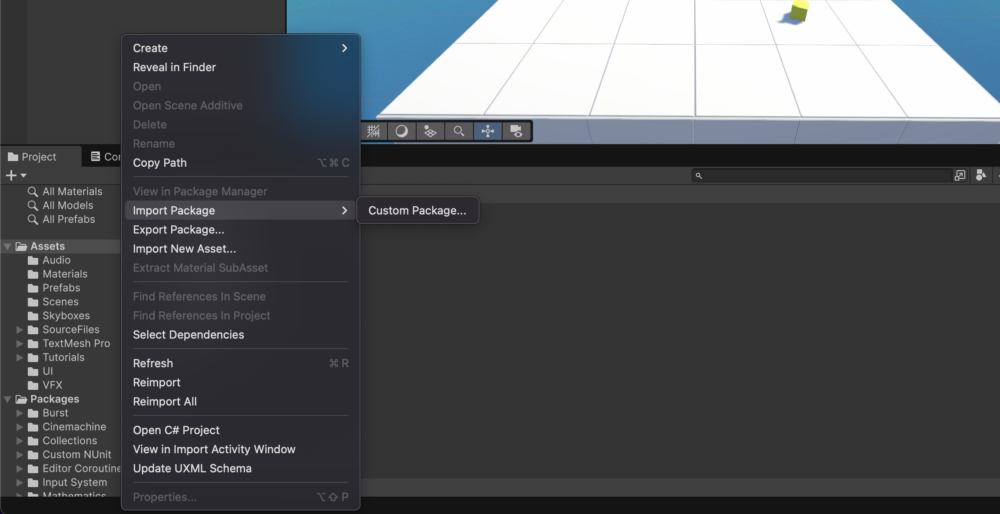
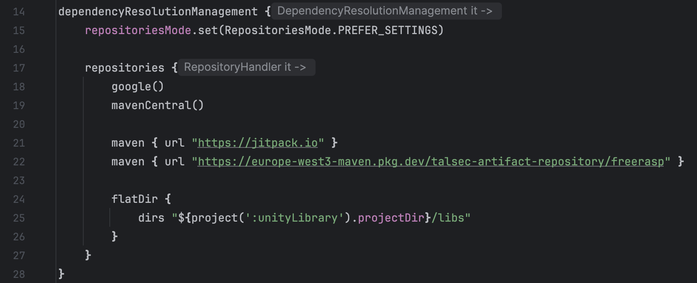

# Android 
## Prerequisites

- Unity 6 and above
- Min SDK level 23 

## Install Plugin
First you will need to install freeRASP for unity. Head over to [Github Unity Plugin Release Link](https://github.com/talsec/Free-RASP-Unity-POC/releases/download/0.1.0/freeRASP.unitypackage). Download the latest plugin. Notice the plugin file ends with .unitypackage

Proceed to import the plugin into your unity project. Right click on Assets -> Import Package -> Custom Package 



## Setup the Configuration for your App
For freeRASP to work properly, you need to configure and initialize it with all the necessary settings. These values need to be completed for the plugin to function correctly. You can find detailed explanations of each configuration option on the API documentation page.

The first step involves obtaining your app's signing certificate hashes in Base64 format. Refer to the provided manual for comprehensive guidance on app signing, which covers both manual signing methods and Google Play's app signing service.

In the entry point to your app, import freeRASP and add the following code:


```csharp 
using UnityEngine;

public class Game : MonoBehaviour
{
    // Start is called once before the first execution of Update after the MonoBehaviour is created
    void Start()
    {
        bool isProd = true;
        string watcherMailAddress = "your_mail@example.com";

        // Android related configs
        string expectedPackageName = "com.unity.rasp.game";
        string[] expectedSigningCertificateHashBase64 = new string[] { "Tmac/QIomCqEGS1jYqy9cMMrqaitVoZLpjXzCMnt55Q=" };
        string[] blacklistedPackageNames = new string[] { "com.spotify.music"};
        string[] supportedAlternativeStores = new string[] { "com.sec.android.app.samsungapps" };

        // initialize talsec
        TalsecPlugin.Instance.initAndroidTalsec(expectedPackageName, expectedSigningCertificateHashBase64,
        blacklistedPackageNames, supportedAlternativeStores, watcherMailAddress, isProd);
        TalsecPlugin.Instance.setAndroidCallback(this); // set Android callback
    }

    // Update is called once per frame
    void Update()
    {
    }
}
```
## Handle detected threats 
Inorder to receive threat notifications, you have to implement the callback AndroidThreatDetectedCallback. This has multiple methods that are triggered when freeRASP periodically checks the device for security threats. Implement these methods inside your Game 

```csharp
// Implementation of AndroidThreatDetectedCallback interface
public void onRootDetected()
{
    Debug.Log("Unity - Root detected");
}

public void onTamperDetected()
{
    Debug.Log("Unity - Tamper detected");
}

public void onDebuggerDetected()
{
    Debug.Log("Unity - Debugger detected");
}

public void onEmulatorDetected()
{
    Debug.Log("Unity - Emulator detected");
}

public void onObfuscationIssuesDetected()
{
    Debug.Log("Unity - Obfuscation issues detected");
}
public void onScreenshotDetected()
{
    Debug.Log("Unity - Screenshot detected");
}

public void onScreenRecordingDetected()
{
    Debug.Log("Unity - Screen recording detected");
}

public void onUntrustedInstallationSourceDetected() {
    Debug.Log("Unity - Untrusted installation source detected");
}

public void onHookDetected() {
    Debug.Log("Unity - Hook detected");
}

public void onDeviceBindingDetected() {
    Debug.Log("Unity - Device binding detected");
}

public void onMalwareDetected(List<SuspiciousAppInfo> malwareList)
{
    Debug.Log("Unity - Malware detected " + malwareList);
}
```

## Add freeRASP Maven Repository 
Once you are done with your game in Unity Hub; proceed to export the project. Once exported, open up the project in Android Studio and add freeRASP’s maven repository address into your `settings.gradle` file. 

```gradle
repositories {
    google()
    mavenCentral()
    maven { url = uri("https://jitpack.io") }
    maven { url = uri("https://europe-west3-maven.pkg.dev/talsec-artifact-repository/freerasp") }
}
```


# iOS 

## Prerequisites

- Unity 6 and above

## Install Plugin
First you will need to install freeRASP for unity. Head over to [Github Unity Plugin Release Link]. Download the latest plugin. Notice the plugin file ends with .unitypackage

Proceed to import the plugin into your unity project. Right click on Assets -> Import Package -> Custom Package 


## Setup the Configuration for your App
For freeRASP to work properly, you need to configure and initialize it with all the necessary settings. These values need to be completed for the plugin to function correctly. You can find detailed explanations of each configuration option on the API documentation page.

In the entry point to your app, import freeRASP and add the following code:

```csharp
using System;
using UnityEngine;
using System.Collections;
using System.Collections.Generic;

public class IOSGame : MonoBehaviour
{
    // Start is called once before the first execution of Update after the MonoBehaviour is created
    void Start()
    {
        // common configs
        bool isProd = true;
        string watcherMailAddress = "your_mail@example.com";

        // iOS related configs
        string[] appBundleIds = new string[] { "com.unity.freeRASP" };
        string teamId = "TEAM ID";

        // initialize talsec
        TalsecPlugin.Instance.initiOSTalsec(appBundleIds, teamId, watcherMailAddress, isProd);
        TalsecPlugin.Instance.setiOSCallback(this); // set callback
    }

}
```

## Handle detected threats 
Inorder to receive threat notifications, you have to implement the callback IOSThreatDetectedCallback. This has multiple methods that are triggered when freeRASP periodically checks the device for security threats. Implement these methods inside your Game 

```csharp
// Implementation of IOSThreatDetectedCallback interface
public void signatureDetected() {
    Debug.Log("Unity - Signature detected");
}

public void jailbreakDetected() {
    Debug.Log("Unity - Jailbreak detected");
}

public void debuggerDetected() {
    Debug.Log("Unity - Debugger detected");
}

public void runtimeManipulationDetected() {
    Debug.Log("Unity - Runtime manipulation detected");
}

public void passcodeDetected() {
    Debug.Log("Unity - Passcode detected");
}

public void passcodeChangeDetected() {
    Debug.Log("Unity - Passcode change detected");
}

public void simulatorDetected() {
    Debug.Log("Unity - Simulator detected");
}

public void missingSecureEnclaveDetected() {
    Debug.Log("Unity - Missing secure enclave detected");
}

public void deviceBindingDetected() {
    Debug.Log("Unity - Device binding detected");
}

public void unofficialStoreDetected() {
    Debug.Log("Unity - Unofficial store detected");
}

public void systemVPNDetected() {
    Debug.Log("Unity - System VPN detected");
}

public void screenshotDetected() {
    Debug.Log("Unity - Screenshot detected");
}

public void screenRecordingDetected() {
    Debug.Log("Unity - Screen recording detected");
}

public void deviceIDDetected() {
    Debug.Log("Unity - Device ID detected");
}
```


## Add freeRASP
Once you are done with your game in Unity Hub; proceed to export the project. Once exported, open up the project in Xcode and add freeRASP dependency 

From GitHub, Copy [Talsec folder](https://github.com/talsec/Free-RASP-iOS/tree/master/Talsec) into your Application folder.
Drag & drop the Talsec folder to your .xcworkspace.
Add TalsecRuntime framework to Target > Build Phases > Link Binary With Libraries.
In the General > Frameworks, Libraries, and Embedded Content choose Embed & Sign.

Note: In case you are using Carthage, the zipped version of the framework is included in the GitHub Releases.

