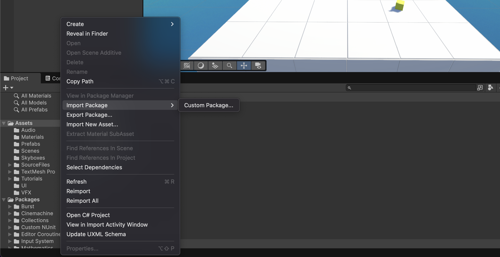
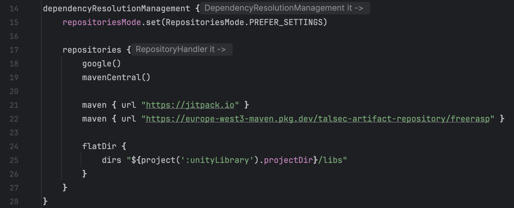

# Android 
## Prerequisites

- Unity 6 and above
- Min SDK level 23 

## Install Plugin
First you will need to install freeRASP for unity. Head over to [Github Unity Plugin Release Link](https://github.com/talsec/Free-RASP-Unity-POC/releases/latest/download/freeRASP.unitypackage). Download the latest plugin. Notice the plugin file ends with .unitypackage

Proceed to import the plugin into your unity project. Right click on Assets -> Import Package -> Custom Package 



## Setup the Configuration for your App
For freeRASP to work properly, you need to configure and initialize it with all the necessary settings. These values need to be completed for the plugin to function correctly. You can find detailed explanations of each configuration option on the API documentation page.

The first step involves obtaining your app's signing certificate hashes in Base64 format. Refer to the provided manual for comprehensive guidance on app signing, which covers both manual signing methods and Google Play's app signing service.

In the entry point to your app, import freeRASP and add the following code:


```csharp 
using UnityEngine;

public class Game : MonoBehaviour
{
    // Start is called once before the first execution of Update after the MonoBehaviour is created
    void Start()
    {
        // common configs
        bool isProd = true;
        string watcherMailAddress = "security@example.com";

        // Android related configs
        string expectedPackageName = "com.unity.freeRASP";
        string[] expectedSigningCertificateHashBase64 = new string[] { "Tmac/QIomCqEGS1jYqy9cMMrqaitVoZLpjXzCMnt55Q=" };
        string[] blacklistedPackageNames = new string[] { "com.spotify.music", "com.leavjenn.hews2" };
        string[] supportedAlternativeStores = new string[] { "com.sec.android.app.samsungapps" };
        
        var androidConfig = new AndroidConfig
        {
            packageName = expectedPackageName,
            signingCertificateHashBase64 = expectedSigningCertificateHashBase64,
            supportedAlternativeStores = supportedAlternativeStores
        };

        var commonConfig = new CommonConfig
        {
            watcherMailAddress = watcherMailAddress,
            isProd = isProd
        };
        
        // set callback
        TalsecPlugin.Instance.setThreatDetectedCallback(this); 
        // initialize talsec
        TalsecPlugin.Instance.initTalsec(androidConfig, null, commonConfig);
    }

    // Update is called once per frame
    void Update()
    {
    }
}
```
## Handle detected threats 
Inorder to receive threat notifications, you have to implement the callback AndroidThreatDetectedCallback. This has multiple methods that are triggered when freeRASP periodically checks the device for security threats. Implement these methods inside your Game 

```csharp
// Implementation of ThreatDetectedCallback interface
public void onPrivilegedAccess()
{
    Debug.Log("Unity - Root detected");
}

public void onAppIntegrity()
{
    Debug.Log("Unity - Tamper detected");
}

public void onDebug()
{
    Debug.Log("Unity - Debugger detected");
}

public void onSimulator()
{
    Debug.Log("Unity - Emulator detected");
}

public void onObfuscationIssues()
{
    Debug.Log("Unity - Obfuscation issues detected");
}
public void onScreenshot()
{
    Debug.Log("Unity - Screenshot detected");
}

public void onScreenRecording()
{
    Debug.Log("Unity - Screen recording detected");
}

public void onUnofficialStore() {
    Debug.Log("Unity - Untrusted installation source detected");
}

public void onHook() {
    Debug.Log("Unity - Hook detected");
}

public void onDeviceBinding() {
    Debug.Log("Unity - Device binding detected");
}

public void onPasscode() {
    Debug.Log("Unity - Unlocked device detected");
}

public void onPasscodeChange() {
    Debug.Log("Unity - Passcode change detected");
}

public void onDeviceID() {
    Debug.Log("Unity - Device ID detected");
}

public void onSecureHardwareNotAvailable() {
    Debug.Log("Unity - Hardware backed keystore not available detected");
}

public void onDevMode() {
    Debug.Log("Unity - Developer mode detected");
}

public void onADBEnabled() {
    Debug.Log("Unity - ADB enabled detected");
}

public void onSystemVPN() {
    Debug.Log("Unity - System VPN detected");
}

```

## Add freeRASP Maven Repository 
Once you are done with your game in Unity Hub; proceed to export the project. Once exported, open up the project in Android Studio and add freeRASP’s maven repository address into your `settings.gradle` file. 

```gradle
repositories {
    google()
    mavenCentral()
    maven { url = uri("https://jitpack.io") }
    maven { url = uri("https://europe-west3-maven.pkg.dev/talsec-artifact-repository/freerasp") }
}
```


# iOS 

## Prerequisites

- Unity 6 and above

## Install Plugin
First you will need to install freeRASP for unity. Head over to [Github Unity Plugin Release Link](https://github.com/talsec/Free-RASP-Unity-POC/releases/latest/download/freeRASP.unitypackage). Download the latest plugin. Notice the plugin file ends with .unitypackage

Proceed to import the plugin into your unity project. Right click on Assets -> Import Package -> Custom Package 


## Setup the Configuration for your App
For freeRASP to work properly, you need to configure and initialize it with all the necessary settings. These values need to be completed for the plugin to function correctly. You can find detailed explanations of each configuration option on the API documentation page.

In the entry point to your app, import freeRASP and add the following code:

```csharp
using System;
using UnityEngine;
using System.Collections;
using System.Collections.Generic;

public class IOSGame : MonoBehaviour
{
    // Start is called once before the first execution of Update after the MonoBehaviour is created
    void Start()
    {
        // common configs
        bool isProd = true;
        string watcherMailAddress = "security@example.com";

        // iOS related configs
        string[] appBundleIds = new string[] { "com.unity.freeRASP" };
        string teamId = "TEAM ID";
        
        // Create iOS config struct
        var iosConfig = new IOSConfig
        {
            appBundleIds = appBundleIds,
            appTeamId = teamId
        };

        var commonConfig = new CommonConfig
        {
            watcherMailAddress = watcherMailAddress,
            isProd = isProd
        };
        
        // set callback
        TalsecPlugin.Instance.setThreatDetectedCallback(this); 
        // initialize talsec
        TalsecPlugin.Instance.initTalsec(null, iosConfig, commonConfig);
    }
}
```

## Handle detected threats 
Inorder to receive threat notifications, you have to implement the callback IOSThreatDetectedCallback. This has multiple methods that are triggered when freeRASP periodically checks the device for security threats. Implement these methods inside your Game 

```csharp
// Implementation of ThreatDetectedCallback interface
public void onPrivilegedAccess()
{
    Debug.Log("Unity - Root detected");
}

public void onAppIntegrity()
{
    Debug.Log("Unity - Tamper detected");
}

public void onDebug()
{
    Debug.Log("Unity - Debugger detected");
}

public void onSimulator()
{
    Debug.Log("Unity - Emulator detected");
}

public void onObfuscationIssues()
{
    Debug.Log("Unity - Obfuscation issues detected");
}
public void onScreenshot()
{
    Debug.Log("Unity - Screenshot detected");
}

public void onScreenRecording()
{
    Debug.Log("Unity - Screen recording detected");
}

public void onUnofficialStore() {
    Debug.Log("Unity - Untrusted installation source detected");
}

public void onHook() {
    Debug.Log("Unity - Hook detected");
}

public void onDeviceBinding() {
    Debug.Log("Unity - Device binding detected");
}

public void onPasscode() {
    Debug.Log("Unity - Unlocked device detected");
}

public void onPasscodeChange() {
    Debug.Log("Unity - Passcode change detected");
}

public void onDeviceID() {
    Debug.Log("Unity - Device ID detected");
}

public void onSecureHardwareNotAvailable() {
    Debug.Log("Unity - Hardware backed keystore not available detected");
}

public void onDevMode() {
    Debug.Log("Unity - Developer mode detected");
}

public void onADBEnabled() {
    Debug.Log("Unity - ADB enabled detected");
}

public void onSystemVPN() {
    Debug.Log("Unity - System VPN detected");
}
```


## Add freeRASP
Once you are done with your game in Unity Hub; proceed to export the project. Once exported, open up the project in Xcode and add freeRASP dependency 

From GitHub, Copy [Talsec folder](https://github.com/talsec/Free-RASP-iOS/tree/master/Talsec) into your Application folder.
Drag & drop the Talsec folder to your .xcworkspace.
Add TalsecRuntime framework to Target > Build Phases > Link Binary With Libraries.
In the General > Frameworks, Libraries, and Embedded Content choose Embed & Sign.

Note: In case you are using Carthage, the zipped version of the framework is included in the GitHub Releases.

